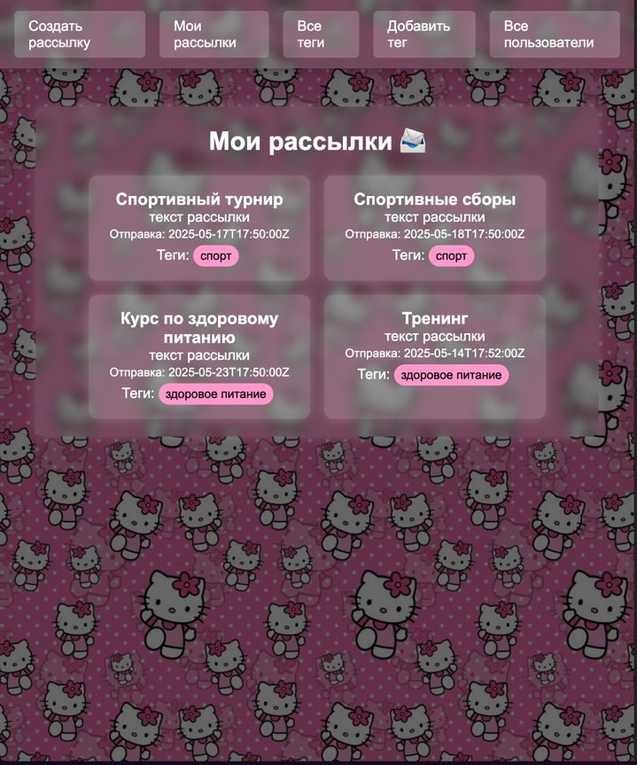

# Лабораторная работа 1. Реализация серверного приложения FastAPI
## Проект и архитектура

Сервис рассылок позволяет организовать отправку электронных писем группам пользователей, объединённых по 
тегам: вы создаёте рассылку с текстом и списком тегов, а система автоматически находит всех подписанных на 
эти теги пользователей и ставит задачи на отправку писем в фоновом режиме через Celery с возможностью 
отложенной доставки. 

В проекте реализована микросервисная архитектура на базе FastAPI и Celery, где каждый компонент развёрнут в своём контейнере:

* **db (PostgreSQL)** — хранит основную бизнес-логическую информацию (пользователи, теги, рассылки).
* **redis** — брокер задач для Celery.
* **backend** — основной API-сервис: управление пользователями, тегами и рассылками.
* **celery** — воркер Celery, обрабатывающий отправку отложенных писем.
* **admin** — отдельный веб-интерфейс для администрирования (FastAPI + Jinja2).

 `docker-compose.yml`:

```yaml
services:
  db:
    image: postgres:15
    container_name: db_newsletter
    env_file: backend/.env
    ports:
      - "5432:5432"
    environment:
      - POSTGRES_PASSWORD=postgres
    restart: unless-stopped
    volumes:
      - postgres_data:/var/lib/postgresql/data/
      - /etc/localtime:/etc/localtime:ro
      - /etc/timezone:/etc/timezone:ro

  redis:
    image: redis:7
    container_name: redis_app

  backend:
    build:
      context: ./backend
      dockerfile: Dockerfile
    env_file: backend/.env
    container_name: mailer_app
    command: [ "uvicorn", "main:app", "--host", "0.0.0.0", "--port", "8000" ]
    ports:
      - "9999:8000"
    depends_on:
      - db
      - celery
    restart: unless-stopped

  celery:
    build:
      context: ./backend
    env_file: backend/.env
    container_name: celery_app
    command: celery -A celery_tasks.setup_celery worker --loglevel=info
    depends_on:
      - redis

  admin:
    build:
      context: ./admin
      dockerfile: Dockerfile
    env_file: admin/.env
    container_name: mailer_web_app
    command: [ "uvicorn", "main:app", "--host", "0.0.0.0", "--port", "8000" ]
    ports:
      - "9998:8000"
    depends_on:
      - db
    restart: unless-stopped
volumes:
  postgres_data:
```

## ORM-модели (SQLAlchemy)

Используется SQLAlchemy + `relationship` для связей `many-to-many` между пользователями и тегами. Пример модели **User**:

```python
from sqlalchemy import Integer
from sqlalchemy.orm import Mapped, mapped_column, relationship
from db.database import Base
from tags.models import Tag

class User(Base):
    __tablename__ = "user"

    id: Mapped[int] = mapped_column(Integer, primary_key=True)
    email: Mapped[str] = mapped_column(unique=True)
    hash_password: Mapped[str]
    tags: Mapped[list[Tag]] = relationship(
        'Tag',
        secondary='user_tag',
        back_populates='users',
        lazy='selectin'
    )
```
### Вложенные сущности в ответе get_all_users 

## CRUD API

Для каждой сущности реализован набор CRUD-эндпоинтов с аннотацией типов:

* **Пользователи** (`/user`): создание, фильтрация, получение по ID и email, обновление, удаление, привязка тега.
* **Теги** (`/tag`): создание, список всех.
* **Рассылки** (`/newsletter`): создание с отложенной отправкой, получение, обновление, удаление.

### Пример эндпоинта и сервисного слоя для создания рассылки

Роутер вызывает метод сервиса NewsletterService, в котором сначала Pydantic-модель NewsletterCreateRequest
переводится в DTO через model_validate и сохраняется в БД, затем для каждого tag_id создаётся связь в 
таблице newsletter_tag. После этого по тегам рассылки вызывается user_tags_service.get_users_by_tag, чтобы получить список 
email-получателей, и для каждого из них через send_letter.apply_async(..., eta=newsletter.target_time) 
ставится отложенная задача в Celery.

### Код роутера и соответствующего сервисного метода, 
отвечающих за создание новой рассылки, привязку тегов и постановку отложенных задач на отправку писем через Celery.

```python
@router.post("")
async def create_newsletter(
    newsletter: NewsletterCreateRequest,
    service=Depends(get_newsletter_service),
) -> NewsletterResponse:
    created = await service.create_newsletter(newsletter)
    return created
```

```python

@dataclass
class NewsletterService:
    newsletters: NewsletterRepo
    tags: TagRepo
    newsletter_tags: NewsletterTagRepo

    async def create_newsletter(
            self,
            newsletter: NewsletterCreateRequest,
    ) -> NewsletterResponse:
        create_dto = NewsletterCreate.model_validate(newsletter)

        created = await self.newsletters.create(create_dto)

        logger.info(created.model_dump())

        for tag_id in newsletter.tags:
            dto = NewsletterTagCreate(
                tag=tag_id,
                newsletter=created.id,
            )

            await self.newsletter_tags.create(dto)

        created = await self.newsletters.get(created.id)

        # Получаем пользователей по тегам и сразу ставим задачи отправки
        user_tags_service = get_user_tag_service()
        recipients = await user_tags_service.get_users_by_tag(
            tags=[tag.text for tag in created.tags]
        )

        for recipient in recipients:
            message = MessageSchema(
                subject=created.subject,
                recipients=[recipient],  # noqa
                body=created.text,
                subtype=MessageType.html
            )
            send_letter.apply_async(
                args=(json_utils.dumps(message, cls=MessageSchemaEncoder),),
                eta=newsletter.target_time
            )
            logging.getLogger(__name__).info(f"Queued email to {recipient}")

        return created

```

## Система миграций (Alembic)

Проект настроен на автоматические миграции через Alembic. 

## Аннотация типов

Во всех роутерах, сервисах и репозиториях используются аннотации и `ConfigDict(from_attributes=True)` для чтения из ORM:

```python
@router.get("")
async def get_all_newsletter(
        newsletter_service = Depends(get_newsletter_service)
) -> list[NewsletterResponse]:
    res = await newsletter_service.get_all_newsletter()
    return res
```

```python
class NewsletterUpdate(BaseModel):
    text: str
    subject: str
    target_time: Optional[datetime] = None

    model_config = ConfigDict(from_attributes=True)
```

## Структура проекта


```
├── admin
│   ├── Dockerfile
│   ├── auth
│   │   ├── auth_form.py
│   │   ├── auth_helper.py
│   │   ├── auth_service_interface.py
│   │   ├── dependencies
│   │   │   └── services.py
│   │   ├── exceptions.py
│   │   └── schemas.py
│   ├── config.py
│   ├── main.py
│   ├── midlewares
│   │   └── auth_midleware.py
│   ├── requirements.txt
│   ├── routes
│   │   ├── __init__.py
│   │   ├── auth_routes.py
│   │   ├── dependencies
│   │   │   └── services.py
│   │   ├── newsletter_router.py
│   │   ├── tag_router.py
│   │   └── user_router.py
│   ├── services
│   │   ├── auth_service.py
│   │   ├── dependencies
│   │   │   └── services.py
│   │   ├── newsletter_service.py
│   │   ├── schemas.py
│   │   ├── tag_service.py
│   │   └── user_service.py
│   ├── static
│   │   ├── css
│   │   │   ├── auth.css
│   │   │   ├── base.css
│   │   │   ├── newsletter.css
│   │   │   ├── newsletter_all.css
│   │   │   ├── newsletter_details.css
│   │   │   ├── tag.css
│   │   │   ├── tags.css
│   │   │   ├── user.css
│   │   │   ├── user_newsletters.css
│   │   │   └── users.css
│   │   └── images
│   │       └── китти.jpeg
│   └── templates
│       ├── __init__.py
│       ├── auth.html
│       ├── base.html
│       ├── newsletter.html
│       ├── newsletter_all.html
│       ├── newsletter_details.html
│       ├── signup.html
│       ├── tag.html
│       ├── tag_all.html
│       ├── user.html
│       ├── user_all.html
│       └── user_newsletters.html
├── backend
│   ├── Dockerfile
│   ├── __init__.py
│   ├── abstractions
│   │   ├── AbstractRepoInterface.py
│   │   ├── AbstractRepository.py
│   │   └── __init__.py
│   ├── alembic.ini
│   ├── celery_tasks
│   │   ├── __init__.py
│   │   ├── setup_celery.py
│   │   └── tasks.py
│   ├── config.py
│   ├── db
│   │   ├── __init__.py
│   │   └── database.py
│   ├── decoder.py
│   ├── docker
│   │   └── start_only_db.bat
│   ├── mail.env
│   ├── mail.env.example
│   ├── main.py
│   ├── migrations
│   │   ├── README
│   │   ├── __init__.py
│   │   ├── env.py
│   │   ├── script.py.mako
│   │   └── versions
│   │       ├── 0db08c43dc72_add_timestamp_with_timezone.py
│   │       ├── 556eade48481_newsletter_target_time.py
│   │       ├── 5e3728acfa88_first.py
│   │       ├── 864ebd0009a9_third.py
│   │       ├── 98b03d0a93c1_second.py
│   │       ├── __init__.py
│   │       ├── cf77bb0027a1_add_userlogin.py
│   │       └── d65fdbfa9353_add_unique_to_emails.py
│   ├── newsletter
│   │   ├── __init__.py
│   │   ├── delayed_letter_service.py
│   │   ├── dependencies
│   │   │   ├── __init__.py
│   │   │   ├── repositories.py
│   │   │   └── services.py
│   │   ├── models.py
│   │   ├── newsletter_service.py
│   │   ├── repository.py
│   │   ├── router.py
│   │   └── schemas.py
│   ├── newsletter_tag
│   │   ├── __init__.py
│   │   ├── dependencies
│   │   │   ├── __init__.py
│   │   │   └── repositories.py
│   │   ├── models.py
│   │   ├── repository.py
│   │   └── schemas.py
│   ├── requirements.txt
│   ├── tags
│   │   ├── __init__.py
│   │   ├── dependencies
│   │   │   ├── __init__.py
│   │   │   ├── repositories.py
│   │   │   └── services.py
│   │   ├── models.py
│   │   ├── repository.py
│   │   ├── router.py
│   │   ├── schemas.py
│   │   └── tag_service.py
│   ├── user
│   │   ├── __init__.py
│   │   ├── dependencies
│   │   │   ├── __init__.py
│   │   │   ├── repositories.py
│   │   │   └── services.py
│   │   ├── models.py
│   │   ├── repository.py
│   │   ├── router.py
│   │   ├── schemas.py
│   │   └── user_service.py
│   ├── user_newsletter
│   │   ├── __init__.py
│   │   ├── models.py
│   │   ├── repository.py
│   │   └── schemas.py
│   └── user_tag
│       ├── __init__.py
│       ├── dependencies
│       │   ├── __init__.py
│       │   ├── repositories.py
│       │   └── services.py
│       ├── models.py
│       ├── repository.py
│       ├── schemas.py
│       └── user_tag_service.py
└── docker-compose.yml
```

## Аутентификация и безопасность

Реализована JWT-аутентификация и хэширование паролей через `bcrypt`.
Пример методов в `AuthService`:

```python
def hash_password(password: str) -> str:
    return bcrypt.hashpw(password.encode(), bcrypt.gensalt()).decode()

def check_password(password: str, hashed: str) -> bool:
    return bcrypt.checkpw(password.encode(), hashed.encode())

def _generate_tokens(self, user_id: int) -> Tokens:
    now = datetime.now(tz=timezone.utc)
    exp = now + timedelta(seconds=self.auth_settings.access_token_lifetime_seconds)
    token = jwt.encode({'exp': exp, 'user_id': user_id},
                       key=self.auth_settings.secret_key.get_secret_value(),
                       algorithm='HS256')
    return Tokens(access_token=token)
```

Промежуточное midleware проверяет наличие и валидность JWT в cookie и перенаправляет на страницу логина при отсутствии:

```python
async def check_for_auth(request: Request, call_next):
    tokens = Tokens(access_token=request.cookies.get("access_token", ""))
    valid = await auth_service.check_tokens(tokens)
    if not valid["is_valid"]:
        return RedirectResponse(f"/auth?destination={request.url.path}", status_code=303)
    request.state.user_id = valid["user_id"]
    return await call_next(request)
```

---

Реализован фронтенд на основе FastAPI + Jinja2: все страницы оформлены через HTML-шаблоны и подключаемые файлы CSS. 

Пример страницы входа:


Пример страницы  создания рассылки


Пример страницы моих рассылок

